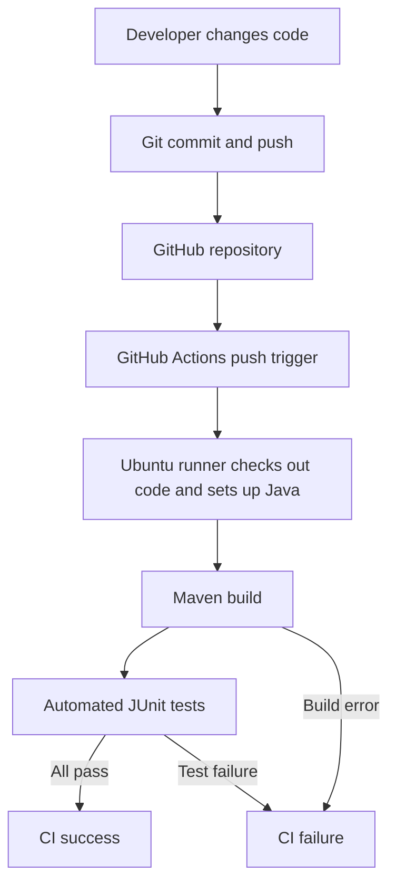

# Unit III: Implementing a CI Pipeline Using GitHub Actions

DRAFT - complete the evidence and student details before submitting.

## 1. Title page

JAIN (DEEMED-TO-BE UNIVERSITY)  
School of Computer Science and Engineering  
Course: 24CSE538 - Cloud DevOps  
Application: Student Result Management  
Name: [YOUR NAME]  
USN: [YOUR USN]  
Section: [YOUR SECTION]  
Date: [SUBMISSION DATE]  
GitHub repository: [ACTUAL REPOSITORY URL]

## 2. Objective

Implement Continuous Integration for a Java application using Maven, JUnit, Git,
GitHub and GitHub Actions. Every push should automatically build the application
and execute its tests on an Ubuntu runner.

## 3. Problem/application description

The application processes an array of subject marks. Each subject is marked out
of 100. The project defines a pass as at least 40 marks in every subject; this is
an application rule, not a statement of university grading policy.

| Method | Input | Result |
| --- | --- | --- |
| calculateTotal | Array of integer marks | Sum of the marks |
| calculateAverage | Array of integer marks | Total divided by the subject count, as a double |
| hasPassed | Array of integer marks | True if all marks are at least 40 |

Null or empty input and marks outside 0-100 produce IllegalArgumentException.
The sample main method processes 80, 75 and 90 and displays a total of 245,
an average of 81.67 and PASS.

## 4. Project structure

| File | Purpose |
| --- | --- |
| src/main/java/com/example/results/StudentResult.java | Application and sample main method |
| src/test/java/com/example/results/StudentResultTest.java | Ten JUnit test cases |
| pom.xml | Maven build, Java version and test dependencies |
| .github/workflows/ci.yml | Push-triggered CI workflow |
| .gitignore | Excludes generated build output and editor files |

[INSERT SCREENSHOT 01: actual project structure]

## 5. Java source code

```java
package com.example.results;

/** Each subject is marked out of 100; passing requires 40 in every subject. */
public class StudentResult {
    public int calculateTotal(int[] marks) {
        validateMarks(marks);
        int total = 0;
        for (int mark : marks) {
            total += mark;
        }
        return total;
    }

    public double calculateAverage(int[] marks) {
        return (double) calculateTotal(marks) / marks.length;
    }

    public boolean hasPassed(int[] marks) {
        validateMarks(marks);
        for (int mark : marks) {
            if (mark < 40) {
                return false;
            }
        }
        return true;
    }

    private void validateMarks(int[] marks) {
        if (marks == null || marks.length == 0) {
            throw new IllegalArgumentException("Provide at least one subject mark.");
        }
        for (int mark : marks) {
            if (mark < 0 || mark > 100) {
                throw new IllegalArgumentException("Marks must be between 0 and 100.");
            }
        }
    }

    public static void main(String[] args) {
        StudentResult result = new StudentResult();
        int[] marks = {80, 75, 90};
        System.out.println("Student Result Management");
        System.out.println("Total: " + result.calculateTotal(marks));
        System.out.printf("Average: %.2f%n", result.calculateAverage(marks));
        System.out.println("Result: " + (result.hasPassed(marks) ? "PASS" : "FAIL"));
    }
}
```

[INSERT SCREENSHOT 02: src/main/java/com/example/results/StudentResult.java]

## 6. JUnit test code

```java
package com.example.results;

import org.junit.jupiter.api.Test;
import static org.junit.jupiter.api.Assertions.*;

class StudentResultTest {
    private final StudentResult result = new StudentResult();

    @Test
    void calculatesTotal() {
        assertEquals(245, result.calculateTotal(new int[]{80, 75, 90}));
    }

    @Test
    void calculatesFractionalAverage() {
        assertEquals(81.6666667,
                result.calculateAverage(new int[]{80, 75, 90}), 0.000001);
    }

    @Test
    void passesWhenEverySubjectMeetsMinimum() {
        assertTrue(result.hasPassed(new int[]{80, 75, 90}));
    }

    @Test
    void passesAtExactBoundary() {
        assertTrue(result.hasPassed(new int[]{40, 40, 40}));
    }

    @Test
    void failsEvenWithHighAverageIfOneSubjectIsBelow40() {
        assertFalse(result.hasPassed(new int[]{100, 100, 39}));
    }

    @Test
    void acceptsZeroAndHundred() {
        assertEquals(100, result.calculateTotal(new int[]{0, 100}));
        assertEquals(50.0, result.calculateAverage(new int[]{0, 100}), 0.000001);
    }

    @Test
    void rejectsEmptyInput() {
        assertThrows(IllegalArgumentException.class,
                () -> result.calculateAverage(new int[]{}));
    }

    @Test
    void rejectsNullInput() {
        assertThrows(IllegalArgumentException.class,
                () -> result.calculateTotal(null));
    }

    @Test
    void rejectsNegativeMarks() {
        assertThrows(IllegalArgumentException.class,
                () -> result.calculateTotal(new int[]{80, -1}));
    }

    @Test
    void rejectsMarksAboveHundred() {
        assertThrows(IllegalArgumentException.class,
                () -> result.hasPassed(new int[]{101, 80}));
    }
}
```

[INSERT SCREENSHOT 03: src/test/java/com/example/results/StudentResultTest.java]

## 7. Maven configuration

```xml
<?xml version="1.0" encoding="UTF-8"?>
<project xmlns="http://maven.apache.org/POM/4.0.0"
         xmlns:xsi="http://www.w3.org/2001/XMLSchema-instance"
         xsi:schemaLocation="http://maven.apache.org/POM/4.0.0 https://maven.apache.org/xsd/maven-4.0.0.xsd">
    <modelVersion>4.0.0</modelVersion>
    <groupId>com.example</groupId>
    <artifactId>student-result-ci</artifactId>
    <version>1.0-SNAPSHOT</version>
    <name>Student Result Management</name>

    <properties>
        <maven.compiler.release>17</maven.compiler.release>
        <project.build.sourceEncoding>UTF-8</project.build.sourceEncoding>
        <junit.version>5.11.4</junit.version>
    </properties>

    <dependencies>
        <dependency>
            <groupId>org.junit.jupiter</groupId>
            <artifactId>junit-jupiter</artifactId>
            <version>${junit.version}</version>
            <scope>test</scope>
        </dependency>
    </dependencies>

    <build>
        <plugins>
            <plugin>
                <groupId>org.apache.maven.plugins</groupId>
                <artifactId>maven-compiler-plugin</artifactId>
                <version>3.13.0</version>
            </plugin>
            <plugin>
                <groupId>org.apache.maven.plugins</groupId>
                <artifactId>maven-surefire-plugin</artifactId>
                <version>3.5.2</version>
            </plugin>
        </plugins>
    </build>
</project>
```

[INSERT SCREENSHOT 04: pom.xml]

## 8. Local test execution and output

Run from a Linux terminal in the folder containing pom.xml:

```bash
mvn --batch-mode --no-transfer-progress clean verify
```

This command removes old build output, compiles the application and tests, runs
JUnit tests, packages the application, and completes the verify phase.

Expected result, to be confirmed with the actual run: 10 tests, 0 failures,
0 errors, 0 skipped and BUILD SUCCESS. This draft does not certify a passing run.

[INSERT SCREENSHOT 05: Linux terminal with Maven command and execution]

[INSERT SCREENSHOT 06: actual test totals and BUILD SUCCESS]

[WRITE the actual result, test count and execution date here.]

## 9. Git/GitHub setup

Initialize the repository, configure your identity, commit the complete project,
create an empty GitHub repository and push the main branch. See README.md for
the commands and authentication guidance.

[INSERT SCREENSHOT 07: git init and git commit output]

[INSERT SCREENSHOT 08: GitHub repository with source, tests, pom.xml and workflow]

Repository URL: [ACTUAL REPOSITORY URL]

## 10. GitHub Actions workflow

The workflow is stored at .github/workflows/ci.yml. It runs on push and also
allows a manual run. The Ubuntu runner checks out the repository, sets up
Temurin Java 17, and executes the same Maven command used locally. Maven's
nonzero exit status on a failing test causes the CI job to fail.

```yaml
name: Java Maven CI

on:
  push:
  workflow_dispatch:

permissions:
  contents: read

jobs:
  build-and-test:
    runs-on: ubuntu-latest
    steps:
      - name: Checkout repository
        uses: actions/checkout@v7

      - name: Set up Java 17
        uses: actions/setup-java@v6
        with:
          distribution: temurin
          java-version: '17'
          cache: maven

      - name: Build and run JUnit tests
        run: mvn --batch-mode --no-transfer-progress clean verify
```

[INSERT SCREENSHOT 09: actual workflow file]

## 11. CI pipeline execution screenshots

[INSERT SCREENSHOT 10: actual workflow run and steps]

[INSERT SCREENSHOT 11: successful CI run overview]

[INSERT SCREENSHOT 12: expanded Maven step with actual JUnit test summary]

Workflow run URL: [ACTUAL RUN URL]  
Commit: [ACTUAL COMMIT HASH]  
Observed result: [ACTUAL CI RESULT]

## 12. CI pipeline diagram

Render this Mermaid diagram or redraw the same flow in your report editor.
Include the rendered diagram in the final PDF, not only its definition.



## 13. Short answer questions

These are suggested explanations. Understand them and rewrite them in your own
words as required by the assignment.

### 1. What is Continuous Integration?

Continuous Integration is the practice of regularly merging code into a shared
repository and automatically building and testing each change. It helps find
integration problems early.

### 2. What is the purpose of pom.xml in a Maven project?

It describes the Maven project, including its identity, dependencies, Java
configuration and build plugins. Maven reads it to compile and test the project
consistently.

### 3. Why is a YAML workflow file required for GitHub Actions?

The workflow tells GitHub which events should trigger automation, which runner
to use, and which steps to execute. In this project, a push starts a job that
checks out the code, sets up Java and runs Maven.

### 4. What is the purpose of a GitHub Actions runner?

A runner is the machine that executes a workflow job. This project uses a
GitHub-hosted Ubuntu runner to perform the checkout, Java setup, build and tests.

### 5. What happens when an automated test fails inside the CI pipeline?

JUnit reports the failed assertion and Maven returns a nonzero exit status.
The Maven step and CI job fail. The developer reads the logs, fixes the issue,
commits the correction and pushes it to trigger another run.

### 6. Differentiate between pom.xml and the GitHub Actions YAML workflow.

| pom.xml | GitHub Actions YAML |
| --- | --- |
| Read by Maven | Read by GitHub Actions |
| XML format | YAML format |
| Defines dependencies and build/test configuration | Defines triggers, jobs, runner and steps |
| Used locally and in CI | Coordinates the automation on GitHub |

The workflow invokes Maven, and Maven then uses pom.xml.

### 7. Explain the complete flow from code change to final CI result.

A developer edits the application or tests, commits the change and pushes it.
GitHub receives the push and starts the workflow. An Ubuntu runner checks out
the commit, sets up Java 17 and runs Maven. Maven compiles the source, executes
JUnit tests and completes the build. GitHub displays success if the job finishes
without errors, or failure if the build or tests fail.

### 8. Why is automated testing important in a CI pipeline?

Automated tests check expected behavior repeatedly without requiring manual
checks for every change. They help detect regressions early and give consistent
feedback. Passing tests improve confidence, but only cover the behaviors that
the tests actually check.

## 14. Conclusion

[After completing the runs, summarize what you actually observed: local Maven
result, test count, push-triggered CI result, and what you learned. Include
any problem encountered and how you fixed it. Do not claim success without
corresponding screenshots.]

## References

- Assignment: Unit3_Practical_CI_Pipeline.pdf supplied by the course.
- GitHub documentation: https://docs.github.com/en/actions/tutorials/build-and-test-code/java-with-maven
- Official action repositories: https://github.com/actions/checkout and https://github.com/actions/setup-java
